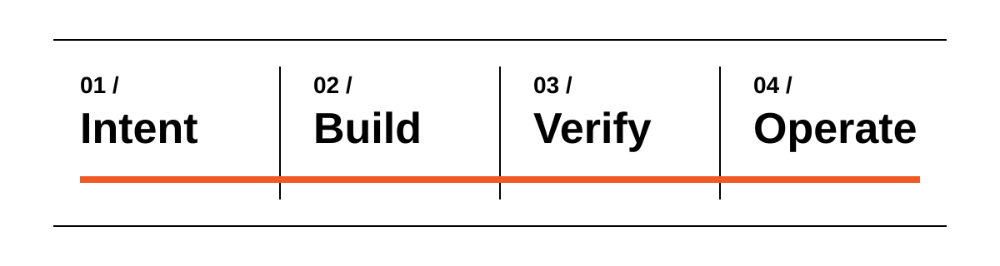

# Awesome Software Factories 

  

> Repeatable systems that turn intent into deployable and maintained software through automated workflows.

This list focuses on active systems that own a repeatable, multi-stage software lifecycle, plus purpose-built infrastructure and first-party evidence from operating factories; generic coding agents, agent frameworks, and workflow automation tools are outside its scope.

## Contents

- [End-to-End Software Factories](#end-to-end-software-factories)
- [Specification-Driven Engineering Systems](#specification-driven-engineering-systems)
- [Business App Factories](#business-app-factories)
- [Modernization Factories](#modernization-factories)
- [Factory Infrastructure and Orchestration](#factory-infrastructure-and-orchestration)
- [Service-Led Software Factories](#service-led-software-factories)
- [Industry Evidence](#industry-evidence)

## End-to-End Software Factories

- [GitLab Duo Agent Platform](https://about.gitlab.com/gitlab-duo-agent-platform/) - Runs governed agents and repeatable flows across planning, coding, security, merge requests, CI/CD, and deployment within GitLab.
- [human](https://github.com/gethuman-sh/human) - Provides an open-source development rig that carries ideas and defects through specification, implementation, review, CI gates, merge, and deployment.
- [Last Light](https://github.com/nearform/lastlight) - Maintains GitHub repositories through issue triage, pull-request review, health monitoring, and an Architect-Executor-Reviewer feature cycle.
- [Mastra Factory](https://mastra.ai/factory) - Runs persistent coding agents across issue intake, triage, planning, implementation, checks, and pull-request review in configurable repository workspaces.
- [Sgai](https://github.com/sandgardenhq/sgai) - Runs a supervised local software factory where a coordinator delegates a goal to specialist agents and executable success checks determine completion.

## Specification-Driven Engineering Systems

- [AI-DLC](https://github.com/awslabs/aidlc-workflows) - Runs a harness-neutral software lifecycle with requirements, design, implementation, review, delivery, approval gates, persistent state, and audit evidence.
- [BMad Method](https://github.com/bmad-code-org/BMAD-METHOD) - Guides new and existing software from clarification and right-sized planning through reviewed implementation, correction, and learning.
- [Conductor](https://github.com/gemini-cli-extensions/conductor) - Maintains project context and guides coding agents through approved specifications, plans, implementation, review, and correction.
- [GSD Core](https://github.com/open-gsd/gsd-core) - Runs milestone phases through discussion, research-backed planning, parallel implementation, verification and repair, and pull-request shipping.
- [Kiro](https://kiro.dev/docs/specs/) - Turns requirements or bug analysis into design documents, dependency-aware tasks, parallel implementation, and correctness checks across IDE, CLI, and web environments.
- [nWave](https://github.com/nWave-ai/nWave) - Guides coding agents through discovery, design, acceptance-test definition, test-driven implementation, and delivery with configurable rigor and human gates.
- [OpenSpec](https://github.com/Fission-AI/OpenSpec) - Maintains reviewable change specifications from exploration and proposal through implementation, verification, and archival into the durable spec set.
- [Spec Kit](https://github.com/github/spec-kit) - Structures software work from project principles and feature specifications through implementation plans, tasks, and coding-agent execution.
- [Spec Kitty](https://github.com/spec-kitty/spec-kitty) - Governs specification-driven software work through planning, isolated worktrees, Kanban state, review gates, and merge controls.
- [Superpowers](https://github.com/obra/superpowers) - Supplies executable coding-agent workflows for requirements discovery, planning, isolated implementation, testing, debugging, review, and completion.

## Business App Factories

- [Appian](https://appian.com/products/platform/low-code) - Builds governed web and mobile process applications with visual design, data integration, and native deployment controls.
- [Appsmith](https://www.appsmith.com/) - Builds and self-hosts internal applications over databases and APIs, with code-level customization, Git version control, and branch-based deployment.
- [Base44](https://base44.com/) - Turns conversational requirements into full-stack applications with managed data, workflows, previews, branches, and publishing.
- [Bubble](https://bubble.io/) - Provides a visual no-code environment for building, testing, and hosting full-stack web and native mobile applications.
- [Budibase](https://budibase.com/) - Builds and self-hosts internal tools over connected data, combining visual applications with automations, agents, permissions, and APIs.
- [FlutterFlow](https://flutterflow.io/) - Visually builds, tests, and deploys Flutter applications for web, iOS, and Android with source-code export.
- [Lovable](https://docs.lovable.dev/) - Builds and publishes full-stack web applications through conversational planning, generation, preview, security checks, and managed cloud services.
- [Mendix](https://www.mendix.com/platform/) - Builds and governs web, mobile, and process applications through model-driven and AI-assisted development.
- [Microsoft Power Apps](https://www.microsoft.com/en-us/power-platform/products/power-apps) - Turns requirements and process models into governed full-stack business applications for web and mobile.
- [NocoBase](https://www.nocobase.com/) - Provides an open-source platform where AI agents and visual builders create relational business systems with workflows and permissions.
- [OutSystems](https://www.outsystems.com/low-code-platform) - Provides a managed low-code lifecycle for designing, testing, deploying, monitoring, and maintaining enterprise applications.
- [Replit Agent](https://replit.com/products/agent) - Builds, tests, fixes, and deploys working applications from conversational requirements in a cloud development workspace.

## Modernization Factories

- [Astadia FastTrack Platform](https://www.astadia.com/our-work/the-migration-factory) - Combines automated code and data conversion, parity testing, and deployment preparation for staged mainframe-to-cloud migrations.
- [AWS Transform](https://aws.amazon.com/transform/) - Coordinates assessment, planning, code transformation, testing, migration, and continuous technical-debt remediation across enterprise workloads.
- [Blitzy](https://blitzy.com/refactor) - Produces refactored or migrated code repositories through specification review, multi-agent generation, compilation, runtime validation, and QA.
- [CodeMie](https://www.codemie.ai/) - Connects application assessment, codebase analysis, migration planning, code transformation, test generation, and deployment workflows for legacy modernization.
- [GitHub Copilot modernization for Java](https://learn.microsoft.com/en-us/azure/developer/java/migration/migrate-github-copilot-app-modernization-for-java) - Assesses and upgrades Java applications with reusable agent tasks for remediation, build repair, testing, containerization, and Azure deployment.
- [Google Cloud Mainframe Modernization](https://cloud.google.com/solutions/mainframe-modernization) - Combines mainframe assessment, business-rule extraction, agentic code transformation, behavioral validation, data migration, and Google Cloud deployment.
- [IBM watsonx Code Assistant for Z](https://www.ibm.com/products/watsonx-code-assistant-z) - Supports mainframe discovery, documentation, refactoring, COBOL-to-Java transformation, compilation, and semantic-equivalence testing.
- [Konveyor](https://konveyor.io/) - Provides an open-source suite for inventorying, analyzing, refactoring, and replatforming applications for Kubernetes and cloud-native environments.
- [Mechanical Orchard Imogen](https://www.mechanical-orchard.com/platform) - Uses source analysis and observed production behavior to generate, validate, and incrementally cut over modern replacements for mainframe workloads.
- [Moderne](https://moderne.ai/) - Runs deterministic framework, language, dependency, security, and build migrations across many repositories with reviewed pull-request output.
- [vFunction](https://vfunction.com/platform/) - Uses static and runtime architecture context to plan modularization, guide code assistants, generate integration tests, and extract or rewrite Java and .NET services.

## Factory Infrastructure and Orchestration

- [AgentsMesh](https://github.com/AgentsMesh/AgentsMesh) - Schedules and supervises coding-agent fleets across isolated worktrees, branches, credentials, and distributed runners.
- [Archon](https://github.com/coleam00/Archon) - Builds repeatable AI-coding harnesses from YAML workflows with planning, implementation, validation, review, and pull-request stages.
- [Eve Software Factory Template](https://github.com/vercel-labs/eve-software-factory-template) - Coordinates GitHub and Linear work through staged implementation and review stations that produce reviewed draft pull requests.
- [Fabro](https://github.com/fabro-sh/fabro) - Runs graph-defined coding workflows with branching, loops, model routing, Git checkpoints, verification, sandboxes, and human approval gates.
- [Factory](https://github.com/addyosmani/factory) - Provides a reference issue-to-draft-PR workflow with isolated worktrees, verification, and human merge authority for Claude Code and Codex.
- [HAR](https://github.com/os-factory/har) - Adds isolated worktrees, deterministic verification, evidence, and observability to coding-agent workflows through a CLI and MCP interface.
- [Machinist](https://github.com/owainlewis/machinist) - Operates coding workflows through durable events, bounded workspaces, retained artifacts, validation, and pull-request handoff.
- [OrgOps](https://github.com/camplight/orgops/blob/main/docs/WRAPPED_AGENT_INVITES.md) - Bootstraps and coordinates external coding-agent runtimes across pinned hosts and channels with scoped credentials and operator controls.
- [Shipfox](https://github.com/ShipfoxHQ/shipfox) - Runs event-driven engineering workflows with agent and shell steps, executable gates, bounded feedback loops, isolated runners, and monitoring.
- [Warp Factories](https://www.warp.dev/factories) - Defines cloud software factories as code that move work from intake to mergeable pull requests across configurable agents, models, repositories, approval gates, evaluations, and benchmarks.

## Service-Led Software Factories

- [HCLTech AI Force.Software.Mod](https://www.hcltech.com/ai-led-modernization) - Automates legacy-application analysis, code transformation, refactoring, testing, and deployment, with security, compliance, and observability integrated into the delivery process.
- [Lunatech Legacy Modernization with AI](https://blog.lunatech.com/posts/2026-05-26-legacy-modernization-with-ai/) - Defines a seven-phase service method for discovering, rebuilding, parity-testing, migrating, hardening, and handing over legacy-system replacements.
- [Thoughtworks AI/works](https://www.thoughtworks.com/en-us/ai/works) - Connects legacy-code analysis, future-state specifications, generated software, evaluations, runtime maintenance, and governance in an expert-led platform.

## Industry Evidence

First-party reports from organizations operating software factories, with concrete lifecycle scope and measured outcomes.

- [Running a Software Factory Efficiently at Uber Scale](https://www.uber.com/us/en/blog/efficient-software-factory/) - Reports Uber's use of managed agents for code review, CI repair, end-to-end pull requests, incident triage, debugging, and maintenance, with measured adoption, quality, and unit-cost outcomes.

## Contributing

Contributions are welcome. Read the [contribution guidelines](contributing.md) before opening a pull request.
